# 🎯 Learner Website Backend – Kubernetes Deployment

A Node.js + MongoDB REST API backend for learner reporting and management.

This project is containerized using Docker and deployed on AWS EKS via Helm.  
It also supports running locally for development and testing.

## 🛠️ Technologies

- Node.js (Express)
- MongoDB
- Docker
- Kubernetes (EKS)
- Helm

---

## 🚀 Features

- Express.js REST API
- MongoDB integration
- JWT authentication
- CORS support
- Dockerized for easy deployment
- Helm chart to manage Kubernetes configuration
- LoadBalancer Service to expose the API publicly
- Jenkins pipeline for automated build and deploy

---

## 🏗️ Project Structure

```
├── learn-api/ # Helm chart for Kubernetes deployment
├── controllers/ # Express Controllers
├── routes/ # Express routes
├── models/ # Express models
├── database/ # MongoDB connection logic
├── Dockerfile # Docker container definition
├── index.js # Application entry point
├── package.json
└── README.md
```


---

## ⚙️ Configuration

The application requires these environment variables (in Kubernetes, provided via Secrets and ConfigMaps):

| Variable          | Description                          |
|-------------------|--------------------------------------|
| `ATLAS_URI`       | MongoDB connection string            |
| `HASH_KEY`        | Hash key for internal use            |
| `JWT_SECRET_KEY`  | JWT token secret                     |
| `PORT`            | Server port (default: `3001`)        |

---

## 🐳 Docker

### 1️⃣ Build the Docker Image

To build and run locally:

```
docker build -t thirumalai-b10/learn-api:latest .
```

### 2️⃣ Tag Image for ECR

```
docker tag thirumalai-b10/learn-api:latest 975050024946.dkr.ecr.ap-south-1.amazonaws.com/thirumalai-b10/learn-api:latest
```

### 3️⃣ Push Image to ECR

```
docker push 975050024946.dkr.ecr.ap-south-1.amazonaws.com/thirumalai-b10/learn-api:latest
```

### 4️⃣ Run the Docker Container Locally (from ECR Image)

```
docker run -d -p 3001:3001 --name api-learn-ecr \
  -e ATLAS_URI="mongodb-url/learnerReport?retryWrites=true&w=majority" \
  -e HASH_KEY="thisIsMyHashKey" \
  -e JWT_SECRET_KEY="thisIsMyJwtSecretKey" \
  975050024946.dkr.ecr.ap-south-1.amazonaws.com/thirumalai-b10/learn-api:latest
```

### 5️⃣ Run the Docker Container Locally (from local build)

```
docker run -d -p 3001:3001 --name api-learn \
  -e ATLAS_URI="mongodb-url/learnerReport?retryWrites=true&w=majority" \
  -e HASH_KEY="thisIsMyHashKey" \
  -e JWT_SECRET_KEY="thisIsMyJwtSecretKey" \
  thirumalaipy/learnapi:1.0
```

## ☸️ Kubernetes Deployment (AWS EKS)

### Prerequisites

 - AWS CLI configured (aws configure)
 - `kubectl` installed and configured for your EKS cluster
 - Helm installed
 - An ECR repository for your Docker images
 - Jenkins server (with access credentials)
 - Mongo is hosted on the `MongoDB Atlas` and connected to the backend API


### 1️⃣ Create Helm Chart

`helm create learn-api`

### 2️⃣ Install via Custom Values

```
helm upgrade --install learn-api . \
-f values.yaml \
--set-string image.repository="thirumalaipy/learnapi" \
--set-string image.tag="v1" \
--set-string database_url="mongo_db_url" \
--set-string hash_key="thisIsMyHashKeydev" \
--set-string jwt_secret_key="thisIsMyJwtSecretKeyDev" \
--set service.port=80 \
--set service.targetPort=3001 \
--set-string service.type="NodePort" \ 
--set replicaCount=1
```

### 3️⃣ Port Forwarding (For Local Access)

`kubectl port-forward service/learn-api-service 3001:3001 -n lp`


## ☁️ AWS EKS Cluster Setup

### 1️⃣ Create EKS Cluster

```
eksctl create cluster \
  --name thiru-cluster-1 \
  --region ap-south-1 \
  --node-type t2.medium \
  --zones ap-south-1a,ap-south-1b
```

#### Output EKS Cluster

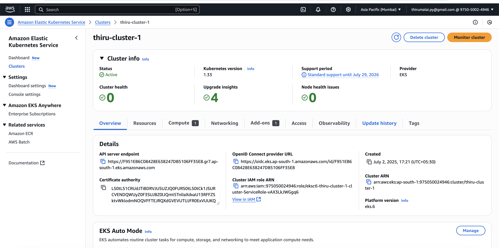

#### Output EKS Cluster - Nodes

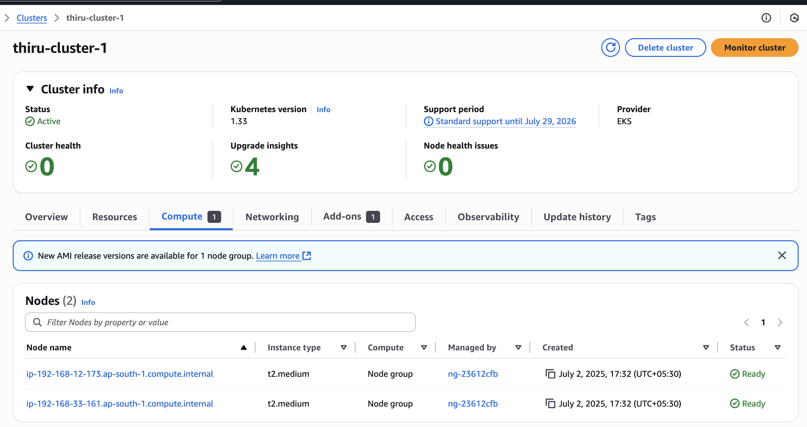

#### Output EKS Cluster - Deployments

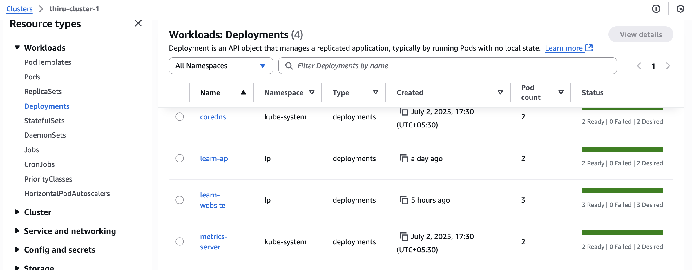

#### Output EKS Cluster - Pods

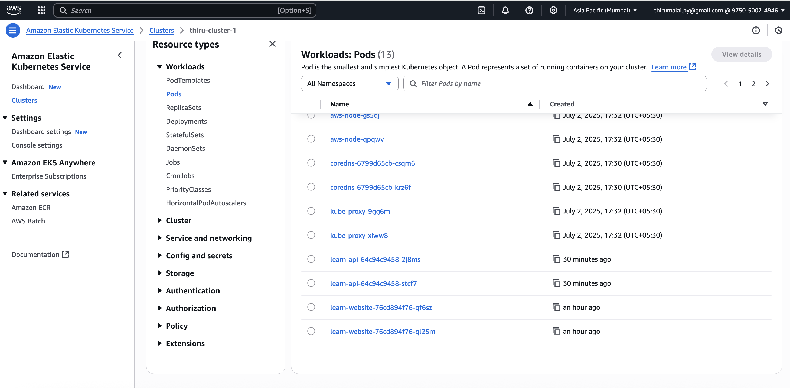

#### Output EKS Cluster - Addons enabled

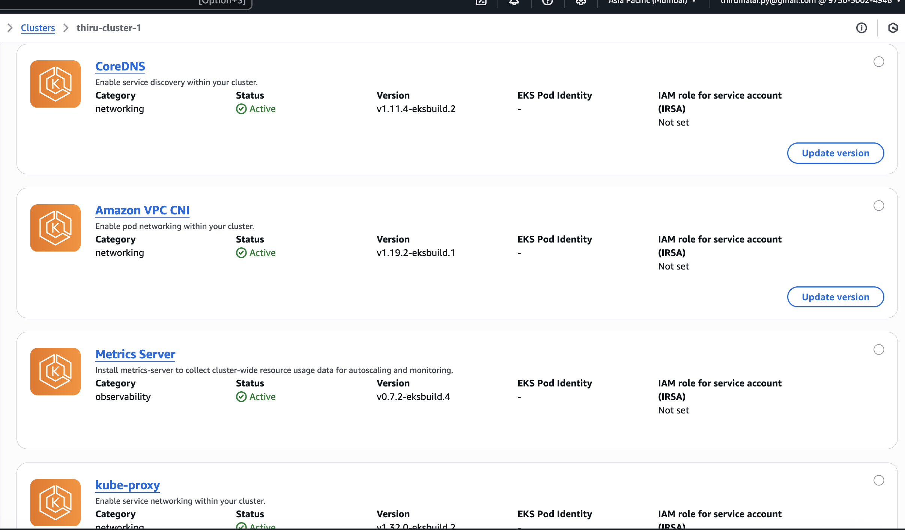


### 2️⃣ Update Local Kubeconfig

`aws eks update-kubeconfig --region ap-south-1 --name thiru-cluster-1`


### 2️⃣ Update Local Kubeconfig

```
kubectl config use-context arn:aws:eks:ap-south-1:<account_id>:cluster/thiru-cluster-1
```

### 3️⃣ Create the namespace

`kubectl create namespace lp`

#### Output EKS Cluster - Namespaces

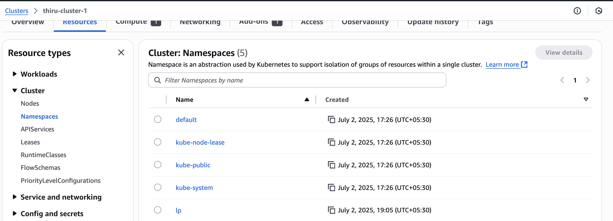

#### Output EKS Cluster - Listing Pods, SVC, Helm

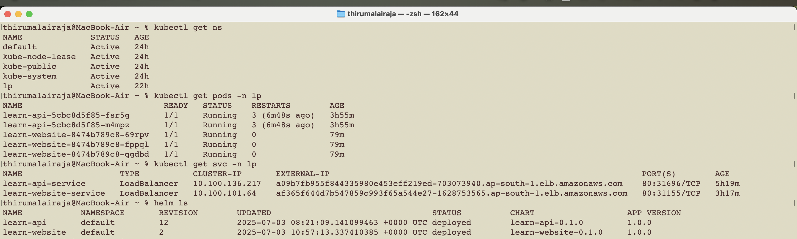

#### Output EKS Cluster - Helm Deployment history

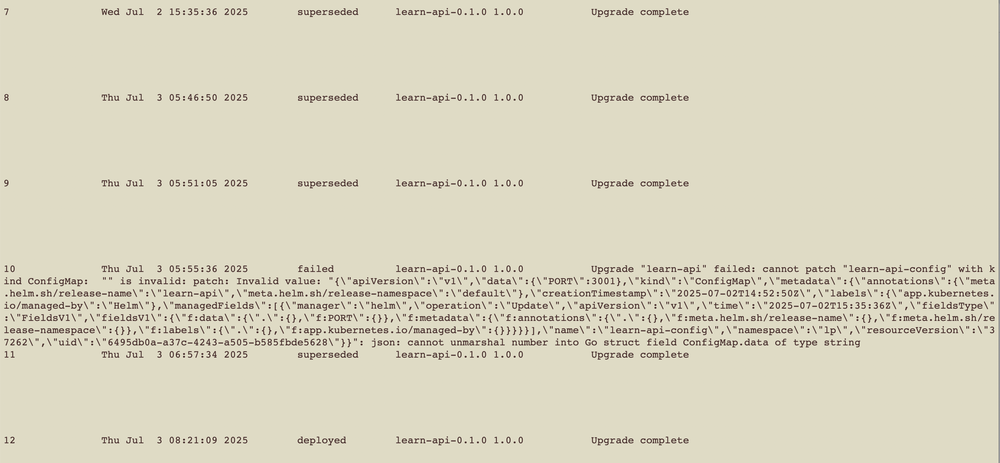


## ⚙️ Jenkins Configuration for Kubectl

### Install kubectl on Jenkins nodes:

```
curl -LO "https://dl.k8s.io/release/$(curl -L -s https://dl.k8s.io/release/stable.txt)/bin/linux/amd64/kubectl"
chmod +x kubectl
sudo mv kubectl /usr/local/bin

kubectl version --client
```

## Jenkins Pipeline Overview

A Jenkins pipeline automates:

1. **Checkout Code**
2. **Build Docker Image**
3. **Push Image to AWS ECR**
4. **Clean up Local Docker Images**
5. **Deploy to AWS EKS using Helm**

### ⚠️ Prerequisites

Before running the pipeline:
 
- Jenkins node has Docker installed and running.
- Jenkins node has kubectl and helm installed.
- Jenkins has these credentials configured:
  - thiru-github-access (GitHub access token)
  - thiru-access-key-id (AWS Access Key)
  - thiru-secret-access-key (AWS Secret Key)
  - learn-api-db (MongoDB connection string)
  - learn-hash-key (hash secret)
  - learn-jwt-secret-key (JWT secret)

#### Output - Jenkin Variables

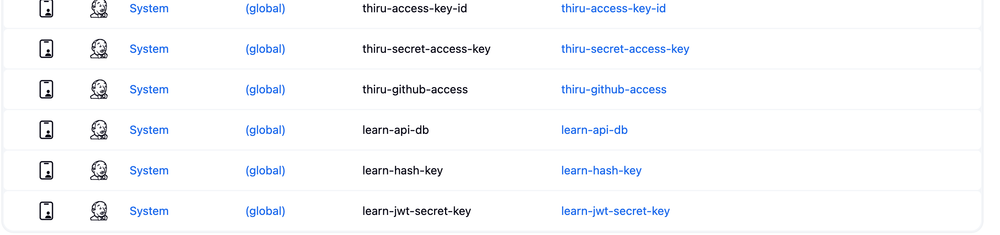

#### Output - Jenkin Pipeline List

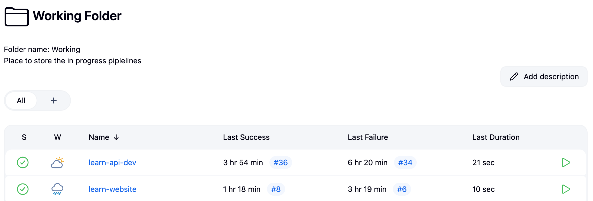

#### Output - Jenkin Build and Push Success to ECR with build number

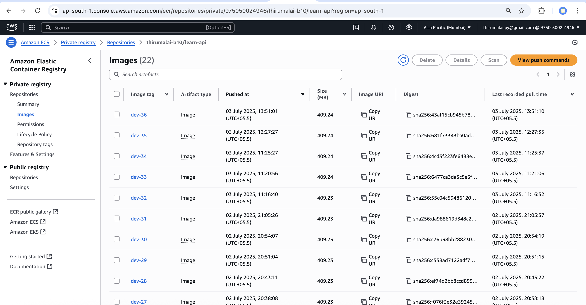

#### Output - Jenkin Pipeline Success

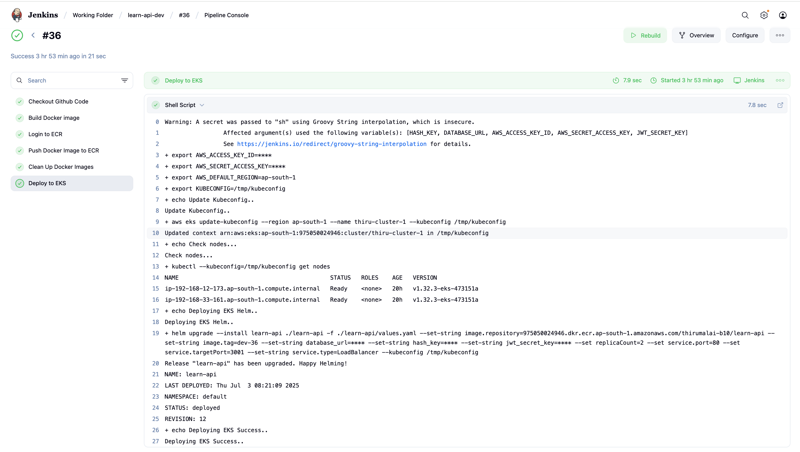

## 📝 Important Notes and Outputs

### ✅ Helm Service Type:

The deployment uses:

`type: LoadBalancer`

This creates an **AWS ELB** exposing the API publicly.

#### Output - AWS Load balancer

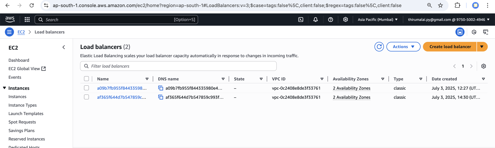


### ✅ Service Port Configuration:

 - Service Port: 80
 - Target Port: 3001

### ✅ Express Binding:

To allow external access via Kubernetes LoadBalancer, you must bind Express to `0.0.0.0`: on the  **index.js**

```
app.listen(port, "0.0.0.0", () => {
  connect();
  console.log(`Example app listening at http://localhost:${port}`);
});
```

### 🌐 Accessing the API

After deployment:

1. Run: `kubectl get svc -n lp`
2. Copy the `DNS` name.
3. Test with curl: `curl http://<load-balancer-dns>/`

#### Output - API working in Loadbalancer DNS end point

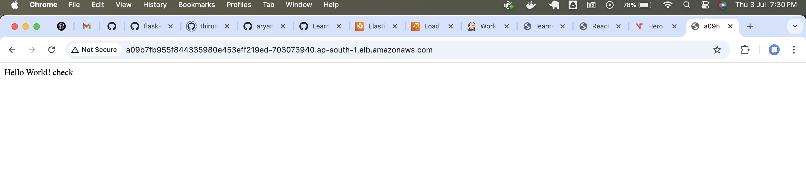


#### Output - API working in Custom APi end point after pointing the DNS CNAME on the domain 

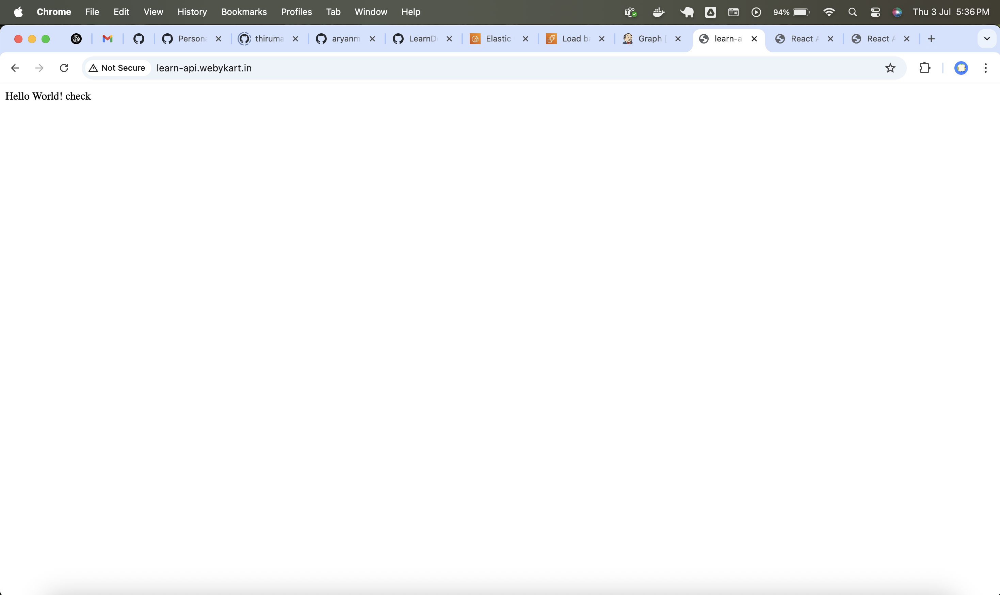


#### Output - Mongo DB Data storing

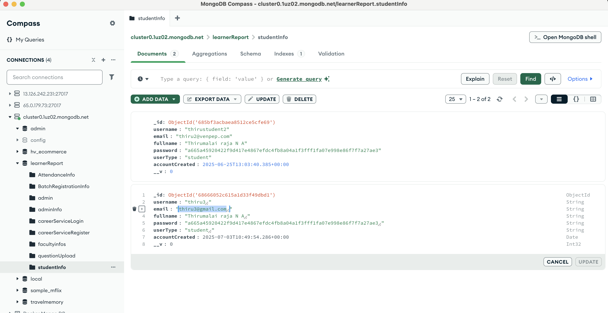


### ✨ SSL Mapping (Optional)

- SSL is optional. You can attach an ACM certificate by adding annotations in your Service manifest.

### 🔧 Debugging Commands:

- `kubectl get pods -n lp` (list pods)
- `kubectl describe pod <pod-name> -n lp` (describe pod)
- `kubectl logs <pod-name> -n lp` (view logs)
- `kubectl logs -f <pod-name> -n lp` (follow logs)
- `kubectl exec -it <pod-name> -n lp -- /bin/bash` (shell into pod, or use /bin/sh)
- `kubectl get svc -n lp` (list services)
- `kubectl describe svc learn-api-service -n lp` (describe service)
- `kubectl get deployments -n lp` (list deployments)
- `kubectl describe deployment learn-api -n lp` (describe deployment)
- `kubectl port-forward service/learn-api-service 3001:3001 -n lp` (port forward in localhost)
- `curl localhost:3001` (test app inside pod)
- `helm list -n lp` (list Helm releases)
- `helm get values learn-api -n lp` (Helm values)
- `helm history <chart-name>` (get the history of helm deployments)
- `helm get manifest learn-api -n lp` (Helm manifest)
- `kubectl config get-contexts` (check contexts)
- `kubectl config current-context` (current context)


